# 🛡️ Creative Authentication System – Spirited Sign-In

A full-stack MERN web app featuring a playful, game-based authentication method called **Spirited Sign-In**, where users sort virtual bottles correctly to gain access. For accessibility, users can also log in through a traditional form-based fallback.

---

## 📌 Table of Contents

1. [About the Project](#1-about-the-project)  
2. [Getting Started](#2-getting-started)  
3. [Features & Usage](#3-features--usage)  
4. [Demonstration](#4-demonstration)  
5. [Architecture / System Design](#5-architecture--system-design)  
6. [Testing](#6-testing)  
7. [Highlights & Challenges](#7-highlights--challenges)  
8. [Roadmap / Future Improvements](#8-roadmap--future-improvements)  
9. [Contributing & License](#9-contributing--license)  
10. [Authors & Contact Info](#10-authors--contact-info)  
11. [Acknowledgements](#11-acknowledgements)  

---

## 1. 🧠 About the Project

### 1.1 Project Description

A creative authentication MERN app where users sort drink bottles in a game to log in (Spirited Sign-In). Features a fallback login, full store functionality, cart, reviews, and a live chatbot.

### 1.2 Built With

- React, Node.js, Express, MongoDB Atlas
- JWT, bcrypt, Multer, Nodemailer, Socket.io, Swagger

---

## 2. 🚀 Getting Started

### 2.1 Prerequisites

- Node.js 18+
- MongoDB Atlas account

### 2.2 How to Install

```bash
# Clone the repo
git clone https://github.com/AngievR05/mern_liquor.git
cd mern_liquor/creative-auth-bartender

# Install backend dependencies
cd server
npm install

# Setup environment variables
cp .env.example .env
# Fill in MONGO_URI, JWT_SECRET, EMAIL_USER, EMAIL_PASS

# Start backend
npm run dev

# Install frontend dependencies
cd ../client
npm install
npm start
```

Visit the app at:  
[http://localhost:3000](http://localhost:3000)

---

## 3. ✨ Features & Usage

| Area           | Features                                                                 |
|----------------|--------------------------------------------------------------------------|
| 🔐 Auth        | Game login + accessible fallback                                          |
| 🛍 Products    | View, add, edit, delete, and like products with image upload support               |
| 💬 Reviews     | Add star ratings (1–5 in 0.25 steps) and comments per product             |
| 🛒 Cart        | Local cart, quantity control, order saving, validation, email receipt     |
| 🤖 Chat Bot    | Typing delay, smart replies, page navigation, iOS-style UI                |
| 📄 Admin API   | Swagger UI available at `/api-docs`                                       |

### Screenshots

## Welcome Screenshot

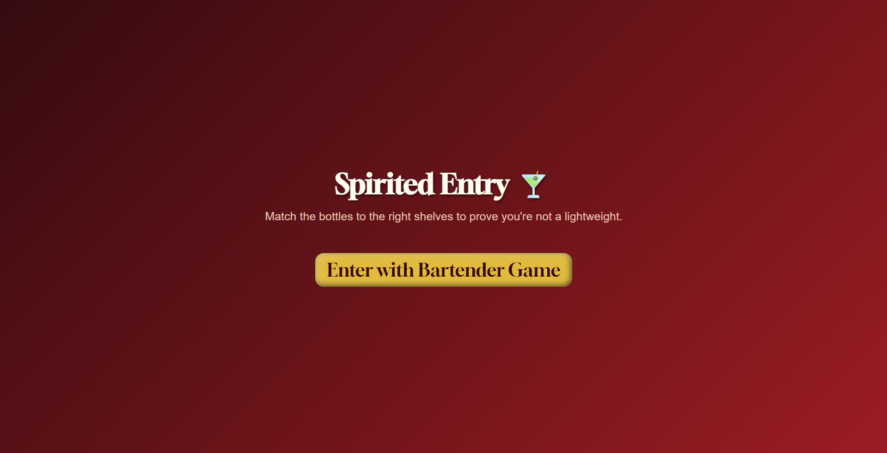

## Game Screenshot

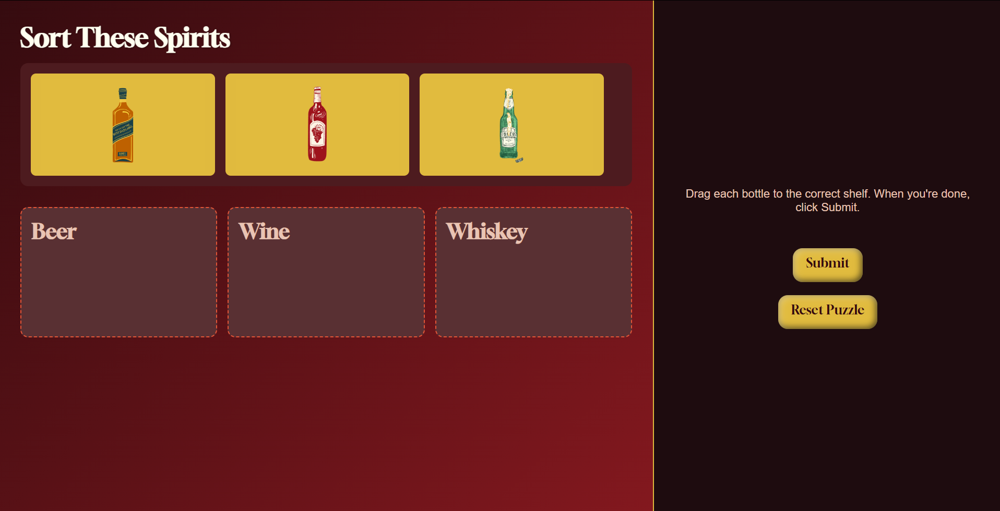

## Home Screenshot

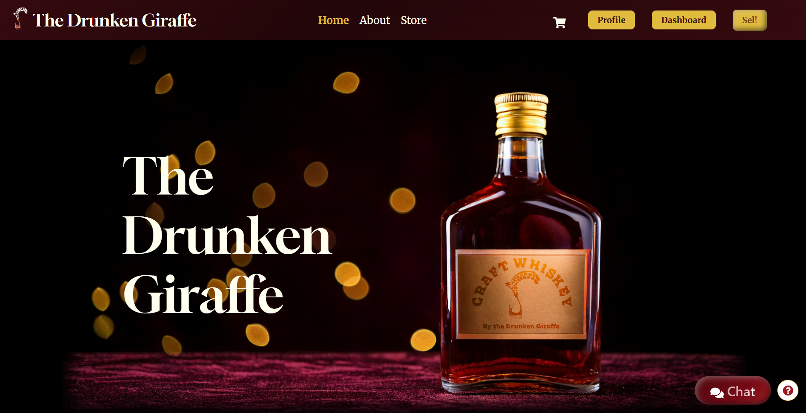

## Chat Widget Screenshot

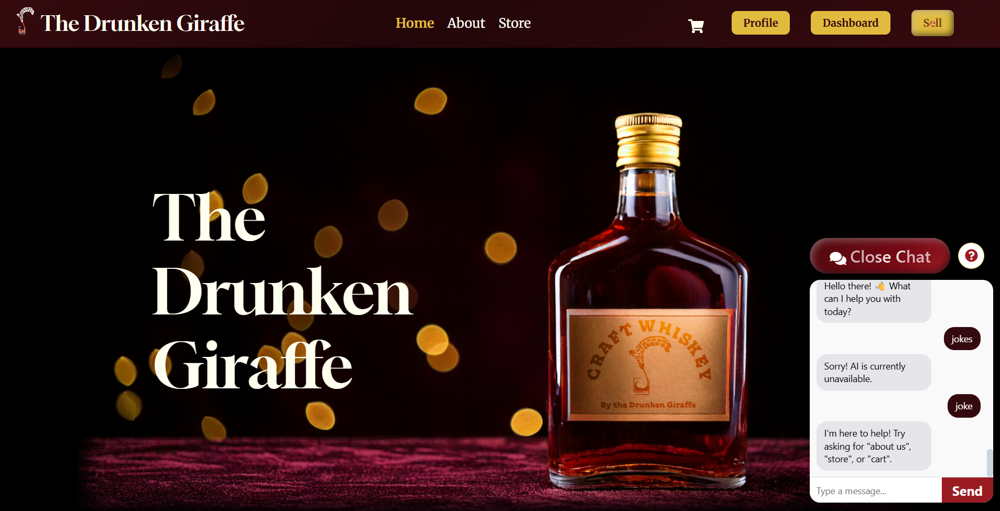

## About Screenshot

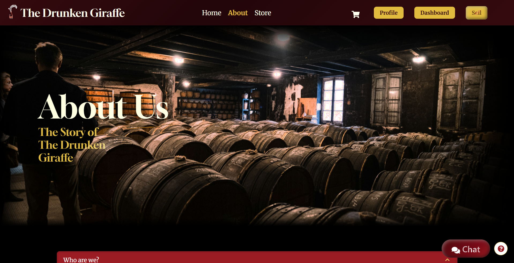

## Store Screenshot

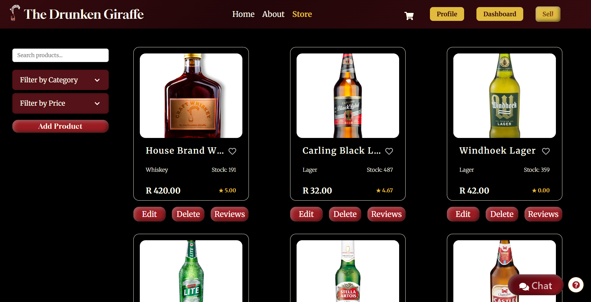

## Cart Screenshot

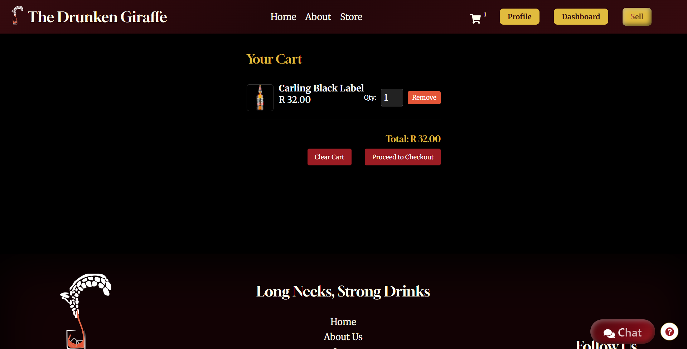

## Checkout Screenshot

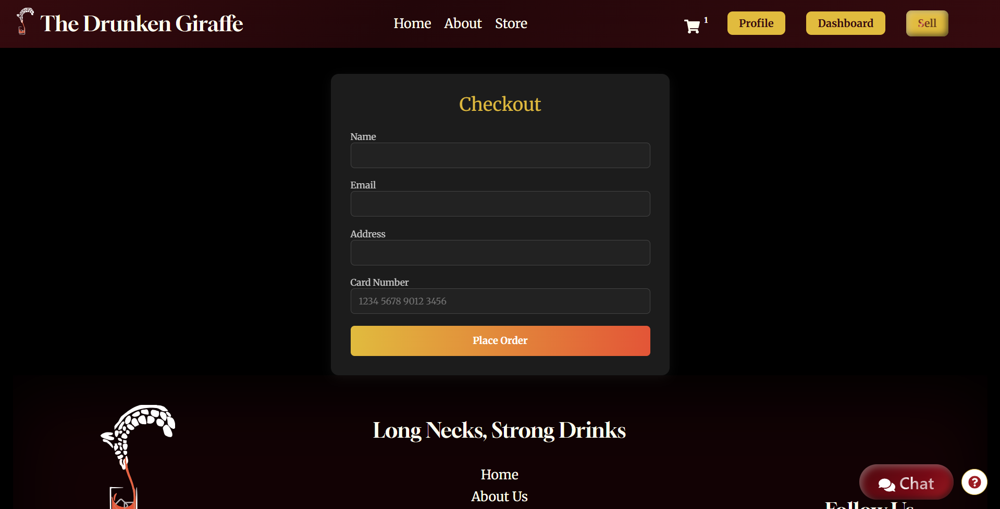

## Dashboard Screenshot

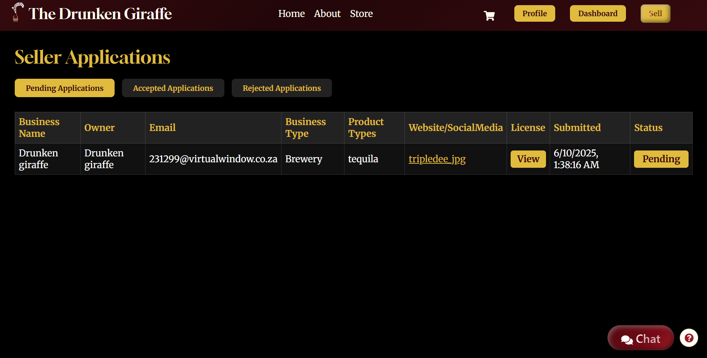

## Seller Screenshot

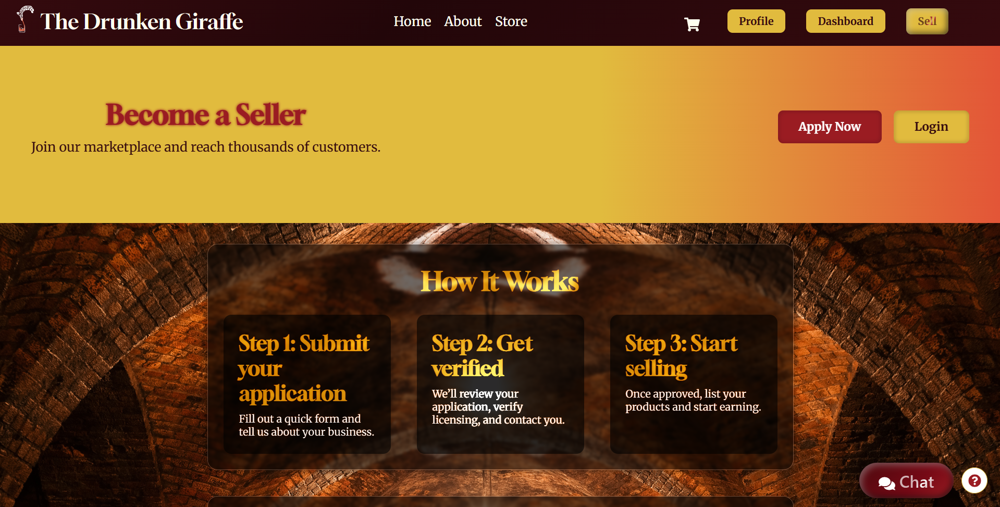

## Application Screenshot

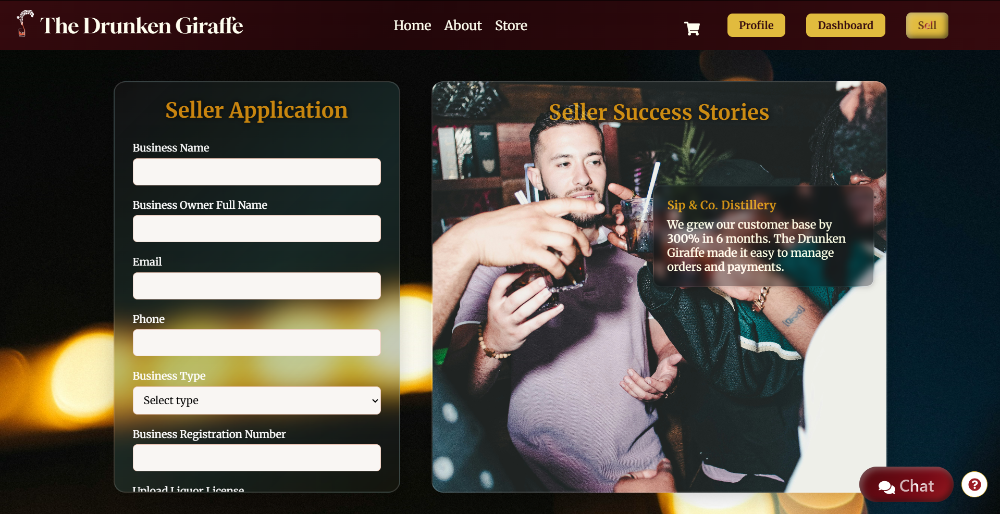

---

## 4. 🎥 Demonstration

[Insert video demo link here – Drive]

**Covers:**

- Registering and logging in  
- Spirited Sign-In in action  
- Cart + checkout + confirmation email  
- Live chatbot  
- Admin product management  

---

## 5. 🧠 Architecture / System Design

- React handles UI with Context for cart
- Node/Express REST API for all features
- MongoDB Atlas stores users, products, orders
- Multer uploads images to `client/public/uploads`
- Nodemailer sends order confirmation emails
- Socket.io powers live chat widget

---

## 6. 🧪 Testing

Manual testing done for:

- ✅ Game login logic
- ✅ Auth & token logic
- ✅ Cart price calculation
- ✅ Order creation & saving

Future: Add automated tests with Vitest or Cypress

---

## 7. ⚡ Highlights & Challenges

| Highlights                            | Challenges                                         |
|---------------------------------------|----------------------------------------------------|
| Spirited Sign-In game login UX        | Uploading images to local storage safely          |
| Star rating and comment UX            | Bot response delays + dynamic page routing        |
| Cart persistence (localStorage)       | Validating checkout + error handling              |
| Autocomplete product search           | Styling chat to feel like native iOS messaging    |

---

## 8. 🔭 Roadmap / Future Improvements

- [ ] User dashboard to track orders   
- [ ] Upload profile pictures to database    
- [ ] Deployment to Render/Vercel/Mongo Atlas  

---

## 9. 🤝 Contributing & License

### Contributing

Contributions are welcome!

```bash
git checkout -b feature/cool-feature
git commit -m "Added something awesome"
git push origin feature/cool-feature
```

Then open a pull request.

### License

This project is **not open source** and is intended for **educational portfolio use only**.

© Bug Squashers 2025. All rights reserved.  
*No redistribution or commercial use permitted.*

---

## 10. 👩‍💻 Authors & Contact Info

**Angie van Rooyen**  
📧 Email: [241077@virtualwindow.co.za](mailto:241077@virtualwindow.co.za)  
🔗 GitHub: [AngievR05](https://github.com/AngievR05)

**Xander Poalses**  
📧 Email: [241322@virtualwindow.co.za](mailto:241322@virtualwindow.co.za)  
🔗 GitHub: [241322](https://github.com/241322)

**Dhiali Chetty**  
📧 Email: [231299@virtualwindow.co.za](mailto:231299@virtualwindow.co.za)  
🔗 GitHub: [Dhiali](https://github.com/Dhiali)

**Tsungai Katsuro**  
📧 Email: [tsungai@openwindow.co.za](mailto:tsungai@openwindow.co.za)  
🔗 GitHub: [TsungaiKats](https://github.com/TsungaiKats)

---

## 11. 🙏 Acknowledgements

- Open Window Creative Computing Faculty  
- Stack Overflow, GitHub Copilot, MDN  
- Nodemailer + Socket.io Docs  
- The React community  
- Bugs squashed, lessons learned 🐞

> 💡 *“Documentation is the difference between a side project and a usable product.”*  
> — Every senior dev ever
